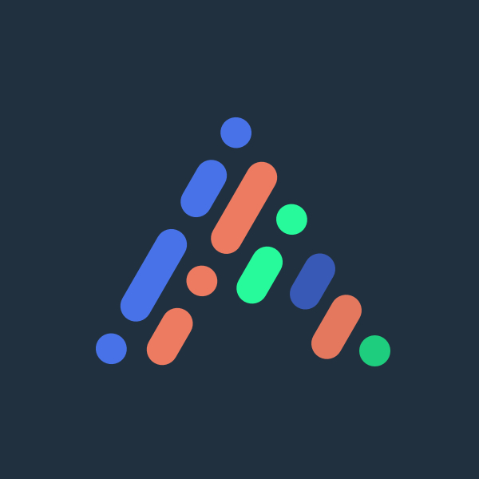

<p align="center">
    
    <br>
    <br>
    
    
    
    
    
    <br>
    <br>
    
    <br>
    <a href="#colaboradores">Colaboradores<a/> •
    <a href="#contactos">Contactos<a/> •
    <a href="#licencias">Licencias<a/>
<p/>

---

# Config Prettier

Utilizando Prettier en nuestro día a día, estas son las configuraciones que se utiliza en **Amosai.Project** para mejor formateo de nuestro código. Si prefieres cambiar o ver qué más configuraciones tiene disponible, checa su [playground](https://prettier.io/playground/).

```json
{
	"arrowParens": "avoid",
	"bracketSpacing": true,
	"htmlWhitespaceSensitivity": "css",
	"insertPragma": false,
	"jsxBracketSameLine": false,
	"jsxSingleQuote": false,
	"printWidth": 80,
	"proseWrap": "preserve",
	"quoteProps": "as-needed",
	"requirePragma": false,
	"semi": true,
	"singleQuote": true,
	"tabWidth": 2,
	"trailingComma": "es5",
	"useTabs": true,
	"vueIndentScriptAndStyle": false
}
```

## Colaboradores

- Santiago Carrasco ([@santychuy](https://github.com/santychuy)) 🎫

## Contactos

Preguntas y sugerencias:

- <amosai.project@gmail.com> ✉️

- [@amosai_project](https://www.instagram.com/amosai_project) 📸
